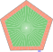

# Groups

* Lamps are organized in groups. A lamp can be in multiple groups.
* Animations are bound on these groups and only lamps in a certain group will be affected by the animation.

## Example

In this lamp we have leds at the edge facing to the front and facing inside. We set multiple groups:
 * On each individual led facing outside, we set the groups **all** and **outer**, so we can turn this leds on individually with these groups. Inside we have **all** and **inner** accordingly.
 * We grouped all 5 edges of the leds facing outside together and set the groups **edge** and **outerEdge**, so we can set colors on edges for a nice effect. Inside we have **edge** and **innerEdge** accordingly.
 * We then grouped these groups to two groups with groups **outerFull**/**innerFull** to turn on all leds facing inside/outside.
 * At the end we grouped the whole lamp together and added another group **full**, so we can turn on all leds with the same color.
