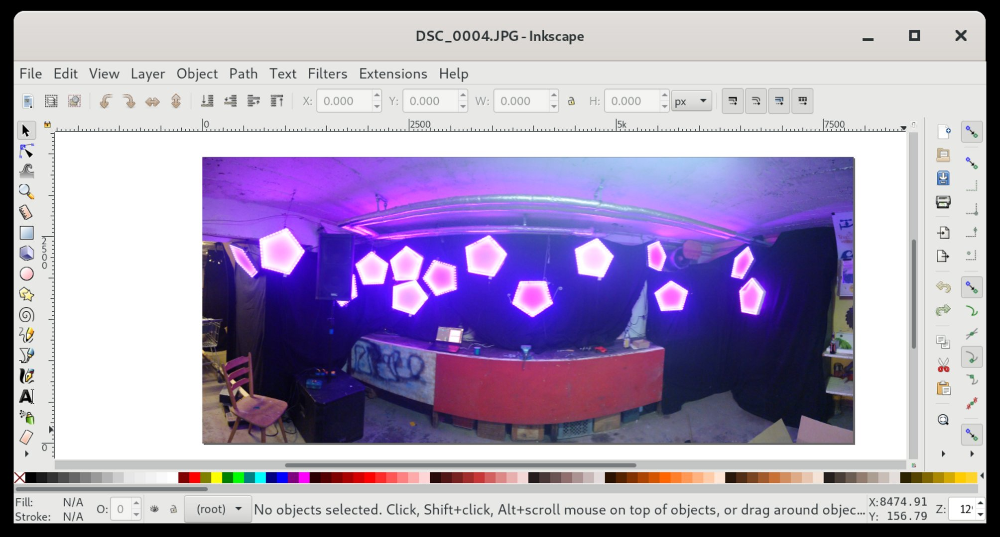
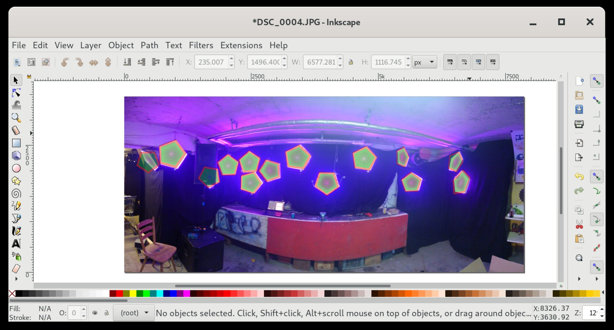
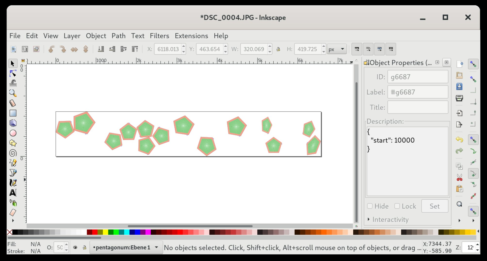

# Setting up an installation

## SVG File

1. Take a picture of your installation and open it in Inkscape.

2. Include, clone and place your lamps in the right position, set the start addresses of your lamps (see [Determining start addresses](determining_start_addresses.md)).

3. Remove picture and set svg window to your needs. We normaly choose a midpoint which fits the installation best.

4. Import your svg file in a GLED project.

## Output Routing

1. Go to `Project` -> `Output Routing`.
2. Find the correct output universe for each gled universe:
  * Our strategy is to set the first lamp to each output universe until we see some lights flashing up.
  * Now we know the output universe of these lights.
  * We look for the internal universe in the svg file and set the correct gled universe to the output universe
  * Repeat until all output universe are correctly set up.