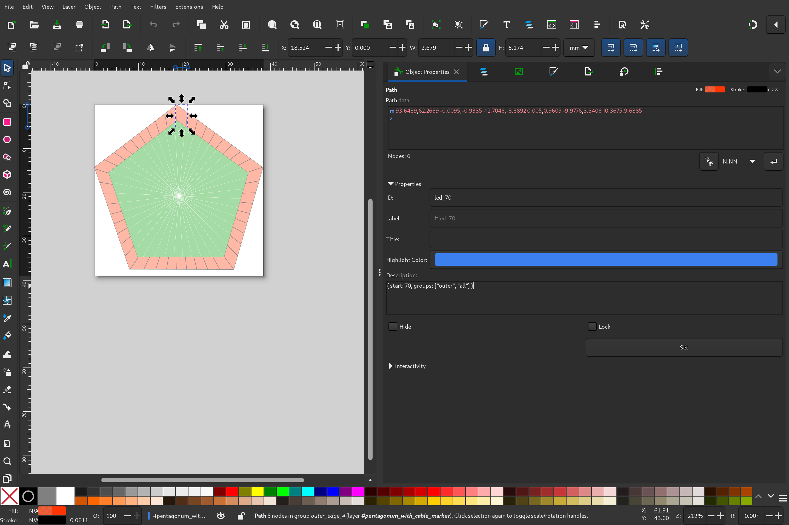

# Creating a SVG file for a lamp

Create a svg file and set parameters of nodes by writing the parameters as [Hjson](https://hjson.github.io/) into description fields.

All fields are optional.

## Parameters

```hjson
{
    groups: ["bla", "blub"],
    start: 42,
    universe: 100,
    count: 100
}
```

### groups

If groups are set, the whole tree under a node is added to these groups.

**default**: *[]*

### start

Start is summed up. If a group has start `10` and a child node of this group has start `5`, the child node has start `15`. The number is used as the start address of the lamp * 3, because each lamp has 3 channels (RGB).

**default**: *0*

### universe

Each string of lamps should get its own universe. These (gled) universes must be patched in Project->Output Routing to your output device universes. If a lamp has more than 170 LEDs, it will be split into multiple universes:
 * Lamp `170` gets addresses `508-510`
 * Lamp `171` gets addresses `0-2` in `universe + 1`

**default**: *0*

### count

You can have multiple lights all at the same positions but with different addresses. If you are setting this values on a svg path, gled sets all light at uniformly distributed positions on the path.

**default**: *1*

## Example



> Be carefull to always press the **Set** button in inkscape!